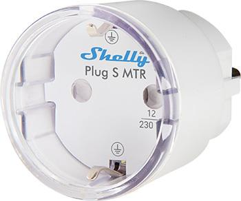

# WiFi

Adafruit.io gør det nemt at integrere WiFi-projekter med dit CircuitPython-board. Du kan fjernstyre dit board, sende data fra board til din computer, eller lade to boards kommunikere. Se vores links til tutorials og projekteksempler for at komme i gang!

### Snyde WiFi-projekt (Ingen kode nødvendig) 😃

Dette er den nemmeste måde at lave et simpelt WiFi-projekt på, selvom det har mange begrænsninger og ikke kræver kodning:

- [Videotutorial](https://www.youtube.com/watch?v=beFuT_hG_LE)
- [Trin-for-trin-guide](https://learn.adafruit.com/quickstart-adafruit-io-wippersnapper?view=all#installing-wippersnapper)

---

### Send data/kommando **til** dit board

Lær hvordan du styrer output via WiFi:

- [Opsætning og simpel tænd/sluk](https://www.youtube.com/watch?v=iFwvvEJ_UwA&list=PLBJJ76R_ry5QY9BU5gqxrvtODWFkkTjYa&index=35&t=1449s)
- [Fortsættelse af ovenstående video med mere avanceret funktionalitet](https://www.youtube.com/watch?v=fjysAa3N2OI&list=PLBJJ76R_ry5QY9BU5gqxrvtODWFkkTjYa&index=36)

<details>
<summary>Kodeeksempel: Styring af NeoPixel-strip med Adafruit IO</summary>

```python
import board
import time
import neopixel
import os
import ssl
import socketpool
import wifi
import adafruit_minimqtt.adafruit_minimqtt as MQTT

# Opsætning af NeoPixel-strip
strip = neopixel.NeoPixel(board.A1, 30)
RED = (255, 0, 0)
BLACK = (0, 0, 0)
strip.fill(BLACK)

# Hent Adafruit IO-brugernavn og nøgle fra settings.toml
aio_username = os.getenv("AIO_USERNAME")
aio_key = os.getenv("AIO_KEY")

# Opsæt en feed til at abonnere på
strip_on_off_feed = aio_username + "/feeds/Strip_on_off"
strip_colour_change = aio_username + "/feeds/Strip_colour_change"

# Opsæt funktioner til at reagere på MQTT-hændelser
def connected(client, userdate, flags, rc):
    print("Forbundet til Adafruit IO! Lytter....")
    client.subscribe(strip_on_off_feed)
    client.subscribe(strip_colour_change)

def disconnected(client, userdata, rc):
    print("Afbrudt fra broker")

def message(client, topic, message):
    print(f"Emne: {topic}, Besked: {message}")
    if message == "ON":
        strip.fill(RED)
        print("ON modtaget")
    elif message == "OFF":
        strip.fill(BLACK)
    elif message.isdigit():
        brightness_level = int(message)
        strip.brightness = brightness_level / 10.0
        print(f"Modtaget lysstyrkeniveau: {brightness_level}")

# Forbind til WiFi
print("Forbinder til WiFi")
wifi.radio.connect(os.getenv("WIFI_SSID"), os.getenv("WIFI_PASSWORD"))
print("Forbundet!")

# Opret en socket-pool
pool = socketpool.SocketPool(wifi.radio)

# Opsæt en MiniMQTT-klient
mqtt_client = MQTT.MQTT(
    broker=os.getenv("BROKER"),
    port=os.getenv("PORT"),
    username=aio_username,
    password=aio_key,
    socket_pool=pool,
    ssl_context=ssl.create_default_context()
)

# Opsæt "callback"-metoderne til MQTT oprettet ovenfor
mqtt_client.on_connect = connected
mqtt_client.on_disconnect = disconnected
mqtt_client.on_message = message

# Forbind til MQTT-broker
print("Forbinder til Adafruit IO....")
mqtt_client.connect()

while True:
    mqtt_client.loop()
```
</details>

<details>
<summary>settings.toml</summary>

```toml
# settings.toml

WIFI_SSID = "wifinavn"
WIFI_PASSWORD = "wifikode"
AIO_USERNAME = "dit adafruit io brugernavn"
AIO_KEY = "din aio nøgle"
BROKER = "io.adafruit.com"
PORT = 1883
```
</details>

---

### Send data/kommando **fra** dit board til din computer/andre boards

- [video 1](https://www.youtube.com/watch?v=565lpAIWjJM&list=PL9VJ9OpT-IPSsQUWqQcNrVJqy4LhBjPX2&index=115&t)
- [video 2](https://www.youtube.com/watch?v=UxhCPdK7W38&t)

---

# Shelly plug
### ID: w1


Shelly er en smartplug til projekter omhandlende strøm. Den kan både bruges uden CircuitPython på sit eget webinterface, som man åbner ved at tilslutte den til strøm, forbinde sin computer til det wifi der dukker op og til sidst gå ind i en browser og skrive: [http://192.168.33.1/](http://192.168.33.1/)  
Så har den nogle indbyggede funktioner man aktiverer, såsom at den tænder kl. 9 hver morgen.

Men denne guide omhandler CircuitPython-brug:

- Brug det indbyggede relæ: tænd og sluk for strømmen til det der sidder i kontakten, fx en lampe, men det kan også være en stikdåse med flere forskellige apparater sat til.
- Relæet kan aktiveres med kode, så du tænder og slukker fx hvert 10. minut, men du kan også bruge alle dine yndlingssensorer til at aktivere strømmen når nogen går ind i rummet eller hvad end du kan finde på!
- Du kan også aflæse en masse spændende data fra shellyplug, fx hvor meget strøm du bruger lige nu, eller hvor meget du har brugt i alt.
- Hvis du sammenkobler dataen med relæet kan du f.eks. skrive kode så strømmen slukker når du har brugt over x antal strøm.
- Du kan også koble skærme eller lys på der reagerer på strømdata for at informere brugerne.
- Den kan altså rigtigt meget!


1. tag et board der har wifi og er circuitpython compatibel (se board guide hvis du er i tvivl)
2. tilslut shelly plug til stikkontakten og se hvilket wifi der kommer op (vær obs. på at der er flere shellyplugs i denne bygning, så vær sikker på at du tager den rigtige)
3. brug koderne herunder og modificer efter dine behov
4. husk at importere lib fx adafruit_requests

<details>
<summary>Kode til relæ</summary>

```python
import wifi
import socketpool
import ssl
import time
import adafruit_requests

# wifi name
SSID = "ShellyPlugSG3-B08184A7C3F0"

# connect to wifi
print("Connecting to Shelly AP...")
wifi.radio.connect(SSID)
print("Connected. ESP32 IP:", wifi.radio.ipv4_address)

pool = socketpool.SocketPool(wifi.radio)
requests = adafruit_requests.Session(pool, ssl.create_default_context())
SHELLY_IP = "192.168.33.1"   # Shelly’s AP IP

# turn on and off
def relay(on=True):
    state = "on" if on else "off"
    print("Setting relay:", state)
    r = requests.get(f"http://{SHELLY_IP}/relay/0?turn={state}")
    print("Shelly says:", r.text)
    r.close()

while True:
    relay(True)
    time.sleep(5)
    relay(False)
    time.sleep(5)
```
</details>

<details>
<summary>Kode til strøm data:</summary>

```python
import wifi
import socketpool
import ssl
import time
import adafruit_requests
import board
import busio
import adafruit_character_lcd.character_lcd_i2c as character_lcd
import json

# wifi name (no password needed on your device)
SSID = "ShellyPlugSG3-B08184A7C3F0"

# connect
print("Connecting to Shelly AP...")
wifi.radio.connect(SSID)
print("Connected. ESP32 IP:", wifi.radio.ipv4_address)

pool = socketpool.SocketPool(wifi.radio)
requests = adafruit_requests.Session(pool, ssl.create_default_context())

SHELLY_IP = "192.168.33.1"

# lcd setup
lcd_columns = 16
lcd_rows = 4
i2c = board.STEMMA_I2C()  # Using STEMMA QT connector
lcd = character_lcd.Character_LCD_I2C(i2c, lcd_columns, lcd_rows)
lcd.clear()
lcd.backlight = True
lcd.message = "Shelly Power\nBooting..."

time.sleep(1)

# get json data
def get_shelly_status():
    url = f"http://{SHELLY_IP}/rpc/Switch.GetStatus?id=0"
    r = requests.get(url)

    raw = r.text  # Read once
    print("RAW:", raw)

    # Parse the JSON manually
    data = json.loads(raw)

    r.close()
    return data

# Main Loop
while True:
    try:
        meter = get_shelly_status()
        power = meter.get("apower", None)

        if power is None:
            print("No power value found.")
            lcd.clear()
            lcd.message = "No data :/"
        else:
            # Print to console
            print("Power:", power, "W")

            # Print to LCD
            lcd.clear()
            lcd.message = f"Power Usage:\n{power:.2f} W"

    except Exception as e:
        print("Error reading meter:", e)
        lcd.clear()
        lcd.message = "Read Error\nCheck Shelly"

    time.sleep(1)
```
</details>