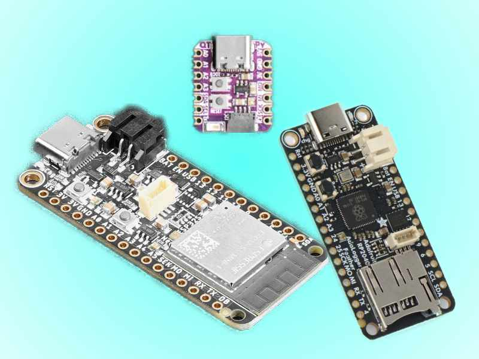
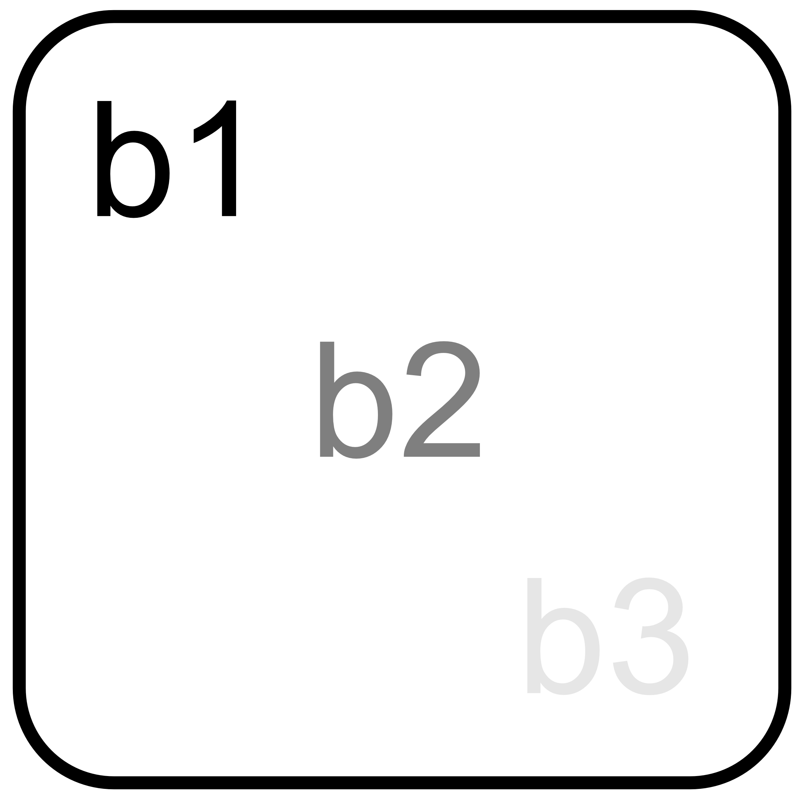
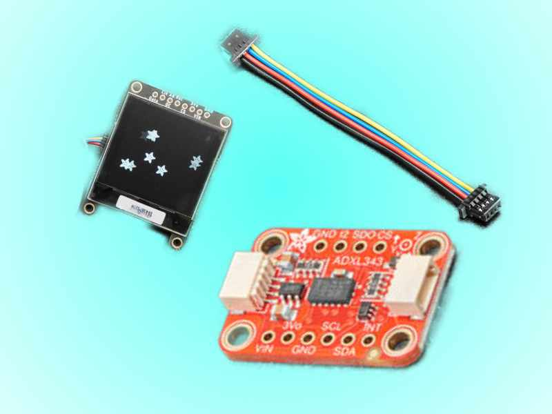
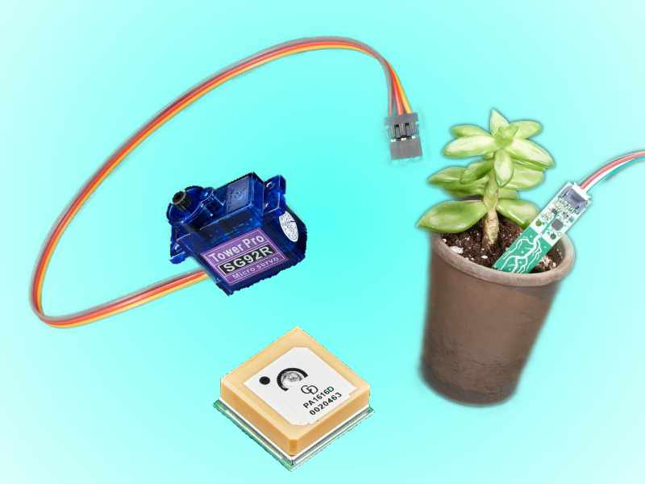
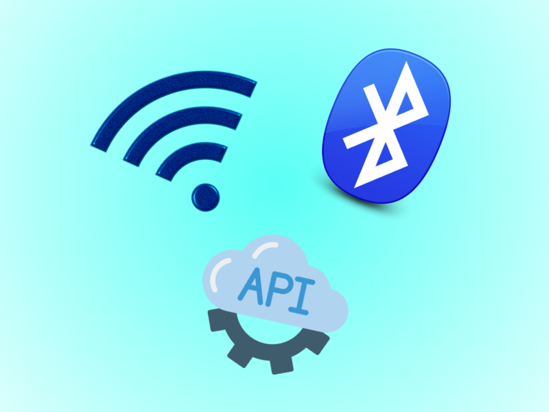

# CircuitPython and STEMMA QT
Overblik over boards og komponenter, som er understøttet af CircuitPython. Både med StemmaQT forbindelse, men også nogle vigtige og fede som er lidt mere komplicerede!
# [Boards](boards)

Læs om vores udvalg af forskellige boards der understøtter circuit python og STEMMA QT forbindelsen.

# [STEMMA QT komponenter](stemmaqt)
Næsten plug-n-play med disse geniale komponenter, som har indbyggede modstande, og kan kædes sammen. 1 kabel er alt du skal bruge!

# [Andre komponenter](other)
Andre komponenter der bruger 2,3,5,10 eller flere ledninger. De fleste er stadig nemme at bruge, og der er mange gode guide at finde herinde, så ikke lad jer skræmme. Der er virkeligt nogle fede ting herinde der kan være prikken over I'et på jeres projekt.

# [Avancerede teknologier](advanced)
Wifi, bluetooth, api mm. Virkeligt fedt, men kræver opsætning og tid.

# [Komplet motor guide](komplet_motor_guide)
Hvad kan de forskellige motorer? hvordan tilslutter man dem? skal de have 3V, 5V, 12V? Find alle svarene herinde!

