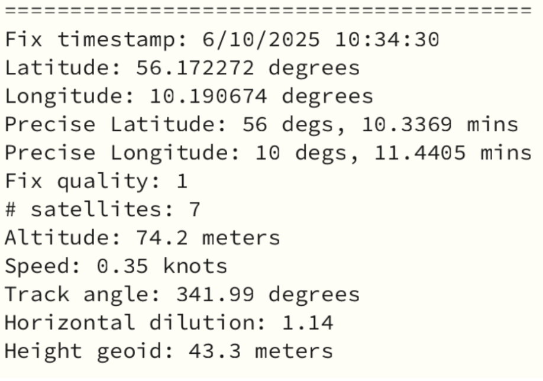

### Hop til komponent (klik)
**Miscellaneous**
- [m1 — Fingerprint sensor](#m1)
- [m2 — GPS](#m2)
- [m3 — Jord fugtighed og temp sensor](#m3)
- [m4 — Taktil knap](#m4)
- [m5 — God skærm](#m5)
- [m6 — Infrafrød transceiver](#m6)
- [m7 — Mosfet motor driver](#m7)
- [m8 — Servo motor](#m8)
- [m9 — dac lyd minijack](#m9)
- [m10 — dac lyd amp](#m10)
- [m+ — diverse input](#m+)
- [m+ — diverse output](#m++)

# Fingerprint sensor
*ID: m1*
##### Type: INPUT

Læs fingeraftryk med denne sensor. Tilføje fingre/personer der er godkendte. alle andre er ikke. Nu kan dit prototype kun bruges af udvalgte! Den er nem at forbinde, bare følg guiden (4 ledninger i alt):

- [Officiel Guide](https://learn.adafruit.com/adafruit-optical-fingerprint-sensor/circuitpython)

- [Eksempelkode](https://learn.adafruit.com/adafruit-optical-fingerprint-sensor/circuitpython#example-code-3044769)

---

# GPS
*ID: m2*
##### Type: INPUT

Få din præcise lokation på kloden med få meters præcission, inklusiv din højde over havets overflade og din flipping hastighed! En fanstastisk sensor som oven i hatten er skide nem at sætte op. Når man tænder den, skal den bruge 10-30 sekunder på at tænde og forbinde til sattelitter, MEN hvis det er et problem for ens projekt, så har sensoren et batterislot så man kan sætte et knapcellebatteri i, og så holder sensoren sig tændt og er klar med det samme man skal bruge den!

Dataen du kan læse fra gps'en:

Den er nem at forbinde, bare følg guiden (4 ledninger i alt):

- [Officiel Guide](https://learn.adafruit.com/adafruit-ultimate-gps/circuitpython-parsing)

- [Eksempelkode](https://learn.adafruit.com/adafruit-ultimate-gps/circuitpython-python-uart-usage#example-parsing-code-3003973)

---

# Jord fugtighed+temp sensor
*ID: m3*
##### Type: INPUT

Skal du vande din plante når den er tør?mål temperatur og fugtighed i jord. med denne sensor

forbind med i2c (4 ledninger, nemt)

- [Officiel Guide](https://learn.adafruit.com/adafruit-stemma-soil-sensor-i2c-capacitive-moisture-sensor)

- [Eksempelkode](https://learn.adafruit.com/adafruit-stemma-soil-sensor-i2c-capacitive-moisture-sensor/python-circuitpython-test#circuitpython-and-python-usage-3009830)

---

# Taktil knap
*ID: m4*
##### Type: INPUT

en knap, men forbindes med 3 ledninger: 3v, gnd og signal.

- [Beskrivelse](https://www.adafruit.com/product/4431)

- [Eksempelkode](https://learn.adafruit.com/ble-hid-keyboard-buttons-with-circuitpython?view=all#code-dot-py-3052822)

*eksempelkoden er en del af en større kode, så man må selv lige finde de relevante dele og kopiere ud*

---

# God skærm
*ID: m5*
##### Type: OUTPUT

Runde hjørne, fuld farve rgb, lys, skærm der er synlig fra mange vinkler. kan vise animation og i prinippet afspille video. eneste minus er at den skal forbindes med 8 ledninger. Men bare følg guide og tjek at ledningerne sidder de helt rigtige steder, så er den oppe at køre på ingen tid. Guiden er lavet til et feather board, såsom vores esp32 s3 feather, så brug det, så er det nemmere at følge med.

- [Officiel Guide](https://learn.adafruit.com/adafruit-1-47-round-rectangle-tft-display)

- [Eksempelkode](https://learn.adafruit.com/adafruit-1-47-round-rectangle-tft-display/circuitpython-usage#circuitpython-library-installation-3113419)

---

# INFRARØD TRANSCEIVER
*ID: m6*
##### Type: INPUT & OUTPUT

Kan sende OG modtage ir signal. minder om det circuit playground express har indbygget. aflæs signal fra en fjernbetjening eller et andet board, og send et svar tilbage.

- [Officiel Guide](https://learn.adafruit.com/adafruit-infrared-ir-remote-transceiver/overview)

- [Eksempelkode](https://learn.adafruit.com/adafruit-infrared-ir-remote-transceiver/circuitpython#example-code-3175233)

---

# Mosfet motor driver
*ID: m7*
##### Type: OUTPUT

Genialt driver der kan bruges på alle motorer med 2 ledninger, og gør dem mega nemme at tilslutte og bruge. Meget kort og simpel kode og ingen biblioteker. Vi i labbet har brugt 4-5 af dem til vores motor displayboard, og de er bare skide smarte.

- [Officiel Guide](https://learn.adafruit.com/adafruit-mosfet-driver)

- [Eksempelkode](https://learn.adafruit.com/adafruit-mosfet-driver/circuitpython-python#example-code-3133146)

---

# Servo motor
*ID: m8*
##### Type: OUTPUT

Du kender den nok. Det er den mest kendte motor, og det er der en grund til. Den er billig, hurtig og vigtigst af alt: PRÆCIS. Indtil den på en vinkel mellem 0° og 180° og den kører derhen. Kun fantasien sætter grænser for hvad den kan bruges til.

- [Produkt side](https://www.adafruit.com/product/169?srsltid=AfmBOorbmKZ9DP-otstlYhx_XXqialG8IL0dqahxICMzFYD3-6oksMR8)

- [Eksempelkode](https://learn.adafruit.com/circuitpython-essentials/circuitpython-servo)

---

# i2s dac - lydudgang til høretelefon eller batteri-højtaler
*ID: m9*
##### Type: OUTPUT

Skal du bruge lyd? høj lyd? tag din højtaler med minijack-indgang med og forbind til denne, så kan du få lyd på dit projekt. Da de fleste af vores nye boards har digital lyd skal man nemlig bruge en dac (digital to analog converter) til at afspille lyd. Vi har 2 versioner. Denne er til minijack-output, og så har vi den næste m10 som er til de små højtalere vi har i labbet, hvis du vil indbygge en lille højtaler i dit design.

Følg guiden for at se hvordan ledningerne skal tilsluttes :D

- [Official guide](https://learn.adafruit.com/adafruit-pcm510x-i2s-dac)

- [Eksempelkode](https://learn.adafruit.com/adafruit-pcm510x-i2s-dac/circuitpython#wav-playback-3194610)

---

# i2s dac + AMP - lydudgang til de små højtalere vi har i komponentskabet
*ID: m9*
##### Type: OUTPUT

Skal du bruge lyd? En lille højtaler indbygget i designet? så er du kommet til det rigtige sted. Da de fleste af vores nye boards har digital lyd skal man nemlig bruge en dac (digital to analog converter) til at afspille lyd. Vi har 2 versioner. Denne er til at tilslutte de små højtalere vi har i labbet, hvis du vil indbygge en lille højtaler i dit design. Den anden id: m10 er til minijack udgang. 

Følg guiden for at se hvordan ledningerne skal tilsluttes :D

- [Official guide](https://learn.adafruit.com/adafruit-max98357-i2s-class-d-mono-amp)

- [Eksempelkode](https://learn.adafruit.com/adafruit-max98357-i2s-class-d-mono-amp/circuitpython-wiring-test#wave-file-2995561)

---

# Diverse input vi kun har et par stykker af
*ID: m+*
##### Type: input

### 38kh infrared remote decoding receiver
IR modtager. har 2 modtagerer man kan vælge mellem så den nemt kan places godt i jeres design.
- [Produkt side](https://www.adafruit.com/product/5939?srsltid=AfmBOoprkV2DwOVwXSAzJ1OqhcPG6MNjHBDtjlMceZznomTsBvKc6Han)
- [Guide](https://learn.adafruit.com/adafruit-infrared-ir-remote-receiver)
- [Eksempelkode](https://learn.adafruit.com/adafruit-infrared-ir-remote-receiver/circuitpython-and-python#example-code-3170190)

---